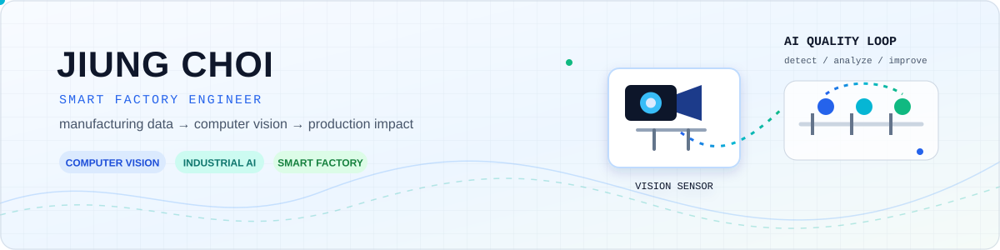

---

## About Me

| 🌱 Currently Learning | 🎯 Current Focus |
| --- | --- |
| MLOps for edge/industrial AI, robust computer vision, and data-driven manufacturing | Turning factory data and vision models into dependable production systems |

- Smart Factory Engineer at **Hyundai Motor Company** in Ulsan, South Korea
- Electrical Engineering major with a Computer Science / AI Computing background at **Kyungpook National University**
- Interested in computer vision, anomaly detection, industrial data analytics, and AI-enabled quality & safety systems
- I enjoy translating real shop-floor problems into measurable AI solutions

## Tech Stack

  
  
  
  
  
  
  
  
  
  
  
  

## Selected Work

### 🛡️ AI Safety Vision for Press Operations
Developing a thermal-imaging human-detection system to help prevent hazardous equipment operation when a person enters a restricted area. The work covers ROI design, model-operation policies, interlock integration, data feedback loops, and reliability validation for the production floor.

### 🔍 Glass Sealer Quality Inspection
Developed an enhanced vision-inspection algorithm for sealer application in an automotive assembly plant, reducing missed defects by over 50% and false positives by over 10% compared with the existing inspection system.

### 🏭 Factory BI & Manufacturing Data Education
Driving data standardization and visualization initiatives for production, quality, and equipment KPIs. I also teach practical Python-based manufacturing analytics, from data cleaning and visualization to classification, regression, and bottleneck analysis.

### 👁️ Curtain Airbag Twist Inspection
Exploring vision-based inspection strategies for assembly anomalies in constrained line environments, including the trade-offs between supervised classification, segmentation, and anomaly detection when NG data is scarce.

> Details are intentionally generalized to respect workplace confidentiality.

## Project History

| Area | Highlights |
| --- | --- |
| **ADAS Computer Vision** | Built a YOLOv5-based ADAS project for lane, traffic-sign, and pedestrian recognition through the Hanium ICT Mentoring program. |
| **Quality AI** | Achieved a top score of **0.974** in a ship-painting defect classification project; participated in LG Aimers quality classification. |
| **Data Science** | EV charging-demand forecasting project — Encouragement Award, Daegu Big Data Competition. |
| **Autonomous Systems** | Developed autonomous-driving and vision components for an AGV-based inventory automation capstone. |

## Certifications & Recognition

- Electrical Engineer (전기기사)
- Big Data Analyst (빅데이터분석기사)
- HDAT Certified Instructor
- Gold Award — Creative Engineering Competition
- Honorable Mention — Hanium ICT Mentoring
- 3rd Place — Energy Category, Daegu Metropolitan City Big Data Analysis Competition

## What I'm Building Next

- Production-grade computer vision with robust monitoring and feedback data loops
- Faster, leaner inference pipelines for high-throughput inspection
- AI agent and analytics tools that make manufacturing knowledge more accessible
- Open-source projects around industrial vision and factory data

---

<i>“Build AI that earns trust on the factory floor.”</i>

<a href="https://www.linkedin.com/in/jiung-choi-290764374/">Let’s connect on LinkedIn</a>

